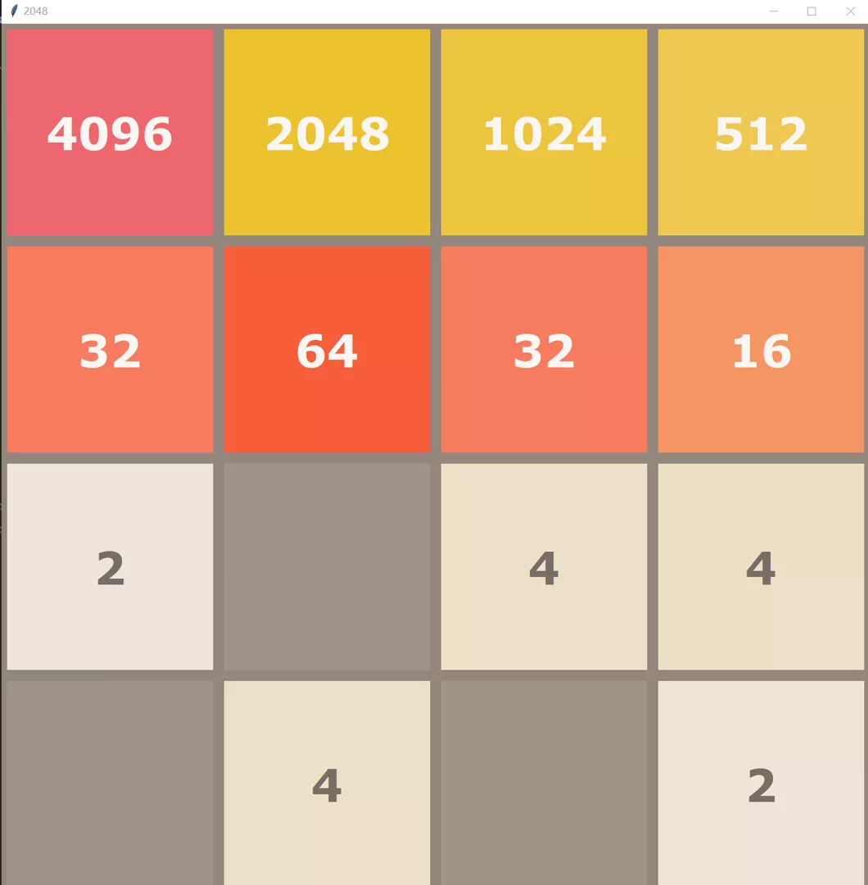

# 2048-AI
A Python AI for the [2048 game](https://2048game.com/) based on *expectimax optimization*


## Requirements  
To install requirements  
``` 
conda env create -f environment.yml
```
## Play
```bash
conda activate 2048_ai
python ai.py
```
## Test result
Result of 10000 runs
### Score
* Average score: 27373
* Best score: 104116
### Probability
* ≥ 1024: 94.63%
* ≥ 2048: 64.86%
* ≥ 4096: 7.16%
* ≥ 8192: 0.01%
### Speed
* Speed: 4.401 ms/step (without GUI)
## Acknowledgements
[2048-GUI](https://github.com/yangshun/2048-python)  
[Algorithm](https://stackoverflow.com/questions/22342854/what-is-the-optimal-algorithm-for-the-game-2048)